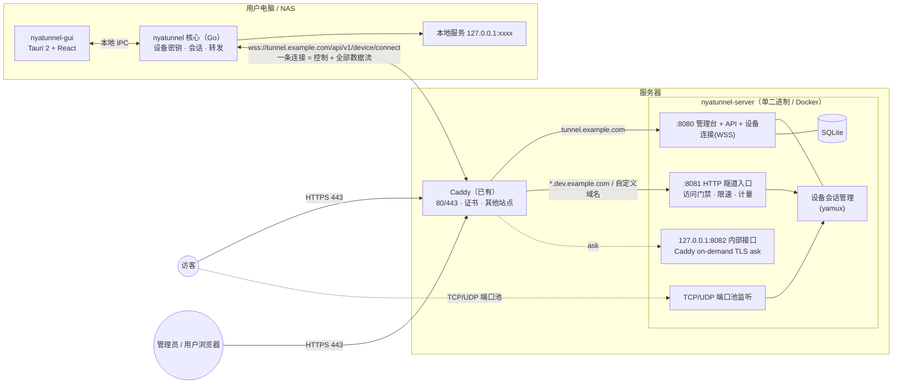
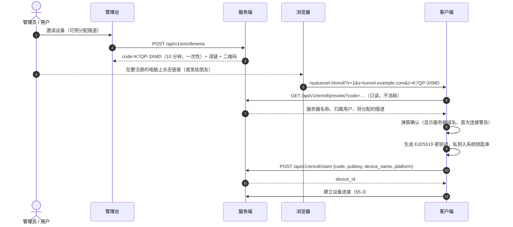
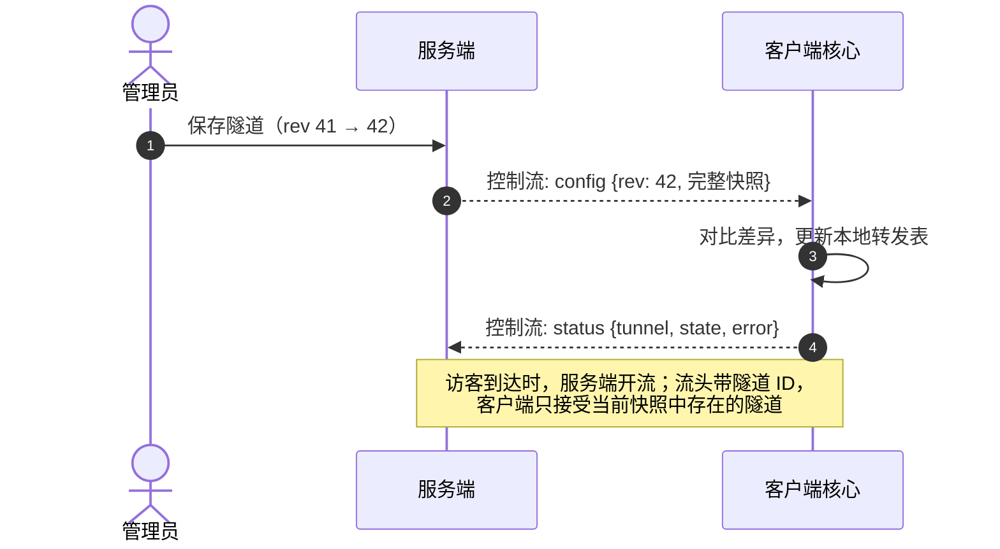

# NyaTunnel 设计方案

> 状态：v0.3（2026-10-04，已按此实现）· 交互原型见 [prototype.html](prototype.html)（浏览器直接打开）
>
> v0.3 变更：协议实现移到公共库 `nyatunnel-common`；GUI 与核心之间改用本机回环 HTTP + 令牌；新增直连 TLS 传输、系统服务、自更新；QUIC 与 PostgreSQL 暂不实现（§15）。
>
> v0.2 变更：数据面改为自研（不再内嵌 frp）；客户端 GUI 改为 Tauri 2 + Go 核心；增加普通用户账号；部署改为在已有 Caddy 之后运行；支持多个隧道域名和自定义域名。

NyaTunnel 是一个自托管的内网穿透工具，服务端带 Web 管理后台，客户端带 GUI。和直接用 frp 的最大区别是：**所有对外暴露的入口只能在服务端后台定义，客户端无法自行添加。**

使用范围：自己和家人朋友。但不假设朋友不会滥用，管理与限制能力按“半信任用户”设计。

---

## 1. 要解决的问题

直接部署 frp 时，frps 只校验一个全局共享的 `token`。任何拿到这个 token 的人都可以：

- 在本地配置里随便写子域名（比如 `admin`、`login`、`paypal-verify`），挂到你的域名下；
- 随便占用服务器端口；
- 无法单独封禁某一个人：要封就得换 token，所有人一起断。

一旦有人在你的域名下挂钓鱼页或违法内容，受影响的是你的域名信誉（Google Safe Browsing、微信/QQ 拦截、注册商投诉、服务器商封机）。

## 2. 核心原则

1. **服务端是配置的唯一权威。** 客户端只持有设备身份，配置全部由服务端下发。客户端 GUI 只读只是体验配合，真正的防线在服务端：数据面由我们自己实现，服务端只会为“已登记、已启用、属于该设备”的隧道转发流量，客户端没有任何“声明一个新代理”的能力。
2. **深链只传一次性注册码，不传配置。** `nyatunnel://` 可以被任何网页触发、会留在聊天记录和浏览器历史里，所以链接里只有服务器地址 + 一次性注册码（10 分钟、单次）。客户端处理任何深链都必须让用户确认。
3. **每台设备独立身份，可单独吊销。** 设备本地生成 Ed25519 密钥对，私钥不出设备。
4. **每个访客连接都经过服务端代码。** 计量、限速、门禁、即时断开都在一处完成。

## 3. 总体架构



### 3.1 一条连接承载一切

客户端只和服务器保持**一条** WebSocket 连接（经 Caddy 的 443，任何能上网的环境都能连通）：

1. 连接建立后先做设备认证（§5.3），通过后在这条连接上跑 [yamux](https://github.com/hashicorp/yamux) 多路复用；
2. 客户端打开的第一条流是**控制流**：配置下发、状态上报、申请、日志都走它（JSON 消息，见协议）；
3. 每来一个访客连接，服务端在这条会话上**开一条新流**，流头写明隧道 ID、访客地址，客户端据此连接本地目标并双向拷贝。

好处：

- 控制和数据天然绑定在同一个已认证会话上，不存在“数据面绕过控制面”的可能；
- **吊销 = 关闭会话**，所有隧道即时断开；
- 不需要额外开放端口（TCP/UDP 隧道自身的端口除外）。

后续可选传输（M4）：直连端口上的 TLS（证书在注册时钉住）以及 QUIC，用于对性能更敏感的场景。传输层抽象成 `net.Conn`，上层 yamux 与协议不变。

### 3.2 为什么自研而不是内嵌 frp

| | 内嵌 frp | 自研 |
|---|---|---|
| 设备身份 | 只有全局 token，设备身份只能塞进 `metas` | 设备密钥直接认证会话 |
| 授权 | 通过本机 HTTP 插件回调逐个拒绝 | 根本不存在“客户端声明代理”，服务端只为已登记隧道开流 |
| 吊销 | 拒绝心跳，最长等一个心跳周期 | 关闭会话，即时 |
| HTTP 隧道 | 我们的入口 → frps vhost → 客户端，两层反代 | 我们的入口直接开流 |
| 计量/限速/门禁 | 分散在 frp 与我们之间 | 全部在一处 |
| API 稳定性 | frp 的 Go API 无兼容承诺（v0.67 → v0.71 `client.ServiceOptions` 已有破坏性变更） | 自己掌控 |
| 依赖 | k8s client-go、wireguard、netlink、kcp、oidc… | yamux（frp 底层用的也是它）、标准库 TLS |

放弃的东西：P2P 打洞（xtcp）、KCP、客户端插件（socks5 / 静态文件）、负载均衡组，以及 frp 多年的现网打磨。对策：使用与 frp 相同的底层库；协议解析做模糊测试；M1 就加入长连接、断线重连、慢连接、大流量的集成测试。

## 4. 账号与角色

| 角色 | 能做什么 |
|---|---|
| 管理员 | 全部功能：用户、设备、隧道、域名、端口池、审批、审计、系统设置 |
| 普通用户 | 查看自己的设备与隧道和流量；给**自己**的设备生成注册码；提交隧道申请；在“自助额度”内自行创建隧道（默认关闭）；修改自己的密码与 TOTP |

- **登录**：用户名 + 密码（argon2id）+ TOTP。TOTP 每个账号都可开启，管理员可设“强制所有账号开启”；提供一次性恢复码。连续失败按账号和 IP 限速。
- **会话**：HttpOnly + Secure + SameSite=Strict Cookie，Cookie 只发给管理台域名（host-only）。
- **自助额度**（按用户设置，默认全部关闭 = 一切都要审批）：最多隧道数、允许的类型、子域名必须以 `<用户名>-` 开头、可用端口数、带宽上限、最长有效期。超出额度的需求自动变成申请。
- **禁用用户**：吊销其所有设备、停用其所有隧道。
- 设备与隧道都归属于某个用户；管理员自己的设备归属管理员账号。

## 5. 设备身份

### 5.1 注册（Enroll）



- 注册码：8 位 Crockford Base32，服务端只存哈希；领取接口按 IP 限速，失败 5 次作废。
- 预览不消耗注册码；用户点取消，码依然可用。
- 钓鱼防护：恶意网页可能诱导用户注册到攻击者的服务器。客户端永远弹窗并醒目显示服务器域名；已注册到 A 时指向 B 的深链会提示“将切换服务器”；可选**锁定构建**（ldflags 写死允许的服务器域名），自用推荐开启。
- headless：`nyatunnel enroll https://tunnel.example.com K7QP-3XMD`。
- 普通用户生成的注册码，设备归属该用户。

### 5.2 密钥保存

交互式注册（CLI、桌面端）时私钥存系统钥匙串：Windows 凭据管理器 / macOS Keychain / Linux Secret Service，`identity.json` 只留服务器、设备 ID 等公开信息。没有钥匙串的环境（headless Linux、Docker）以及系统服务，私钥存在仅属主可读的 `identity.json` 中。

### 5.3 设备连接认证

在 WebSocket 建立后、yamux 启动前完成：

1. 客户端发 `hello {device_id, client_version, protocol}`；
2. 服务端回 `challenge {nonce}`；
3. 客户端用私钥签名 `"nyatunnel-connect-v1\n" + host + "\n" + device_id + "\n" + nonce` 回 `auth {signature}`；
4. 服务端验签、确认设备未吊销、归属用户未禁用，回 `welcome {session_id, features}`；否则以关闭码 `4401` 关闭。

签名绑定了服务器域名和一次性 nonce，无法重放或转用到别的服务器。同一设备的新会话会顶替旧会话（关闭码 `4409`）。

### 5.4 吊销

后台吊销设备（或禁用用户）→ 数据库标记 → 立即关闭会话（`4401`）→ 客户端清除本地凭据并回到“未注册”界面。所有隧道随会话关闭即时下线。

## 6. 隧道模型

一条隧道 = 一个对外入口 + 一个本地目标 + 一组策略。

| 分组 | 字段 | 谁能改 |
|---|---|---|
| 公网侧 | 类型（https / tcp / udp / tcp+udp，后者同一端口同时开放两种协议）、域名（子域名或自定义域名）、路径前缀、远程端口 | 管理员；自助额度内的用户 |
| 本地侧 | 本地 IP、本地端口 | 管理员；勾选“允许客户端修改”后设备端也可改 |
| 策略 | 访问策略、IP 白名单、带宽、并发、月流量、到期时间、首次访问提示页、Host 改写 | 仅管理员（用户自助创建时套用其额度的默认值） |
| 开关 | 启用 / 暂停 | 管理员“禁用”优先；勾选“允许客户端暂停”后设备端可暂停 / 恢复 |

“仅允许回环地址”选项可阻止有人借隧道暴露内网中的其他机器。

### 6.1 服务端如何转发

- **HTTPS 隧道**：Caddy 终止 TLS 后转给 `:8081`。入口按 Host 查隧道 → 检查启用/到期/配额 → 执行访问策略 → `httputil.ReverseProxy`，其拨号函数是“在该设备会话上开一条流”。WebSocket、SSE、大文件上传均原样透传。设备不在线时返回友好的 502 页面。
- **TCP 隧道**：服务端在分配的端口上监听，每个访客连接开一条流。
- **UDP 隧道**：按访客地址建立会话，每个会话一条流，数据报加 2 字节长度帧，空闲 60 秒回收。
- 所有流经过统一的计量与限速包装（令牌桶），按隧道和用户累计流量。

### 6.2 访问策略（HTTPS 隧道）

- 公开 / 访问密码 / HTTP Basic / 登录门禁（NyaTunnel 账号）；登录门禁可限定为仅隧道所有人（默认）、所有人 + 指定用户、或本站所有账号，修改范围会让已通过门禁的访客重新登录；
- 可叠加 IP 白名单与首次访问提示页（“这是一个内网穿透地址，请勿输入账号密码”，带举报链接）；
- 门禁 Cookie 为 host-only，只对该隧道域名有效。

TCP/UDP 隧道只支持 IP 白名单（在接受连接时判断）。

## 7. 域名与证书（与已有 Caddy 共存）

### 7.1 域名不写死

域名是后台里的数据，分两种：

| 类型 | 例子 | 用途 | 证书 |
|---|---|---|---|
| 隧道根域名（可多个） | `dev.example.com` | 分配子域名 `xxx.dev.example.com` | Caddy 通配符证书（Cloudflare DNS-01） |
| 自定义域名 | `nas.example.com` | 整个域名指向某条隧道 | Caddy on-demand TLS（首次访问时自动签发） |

管理台自身的域名（如 `tunnel.example.com`）由环境变量 `NYATUNNEL_PUBLIC_URL` 指定，它也是深链和客户端连接用的地址。

### 7.2 职责划分

- **Caddy**：继续占用 80/443，负责所有证书、HTTP→HTTPS 跳转，以及你的其他站点。
- **NyaTunnel**：只监听本机端口，不碰证书：
  - `127.0.0.1:8080` 管理台 + API + 设备连接；
  - `127.0.0.1:8081` HTTP 隧道入口（这个监听器上**永远不提供**管理接口，即使 Host 伪造成管理台域名）；
  - `127.0.0.1:8082` 内部接口（Caddy 的 on-demand TLS 询问），**不要**在 Caddy 里反代它；
  - TCP/UDP 端口池（如 `20000-20099`）直接对外。
- 只信任来自 `NYATUNNEL_TRUSTED_PROXY_CIDRS`（默认 `127.0.0.1/32,::1/128`）的 `X-Forwarded-For`，用于门禁的 IP 白名单与审计。

### 7.3 自定义域名流程

1. 管理员（或有额度的用户提交申请后由管理员批准）在后台添加 `nas.example.com` 并绑定隧道；
2. 后台显示 DNS 指引：`CNAME nas.example.com → tunnel.example.com`（或 A/AAAA 到服务器 IP）；
3. NyaTunnel 检查 DNS 已指向本服务器后把域名标为“已生效”；
4. 访客首次访问时，Caddy 询问 `http://127.0.0.1:8082/caddy/ask?domain=nas.example.com`，只有“已生效”的域名返回 200，Caddy 随即签发证书。

未登记的域名 Caddy 一律不签证书，别人把域名乱指到你服务器上也没用。

### 7.4 子域名规则

- 系统保留：`www`、`admin`、`api`、`login`、`mail`、`auth`、`account`、`sso`、`tunnel`…；
- 品牌与敏感词黑名单（`paypal`、`apple`、`bank`、`wechat`…）；
- 普通用户自助创建时必须以 `<用户名>-` 开头。

### 7.5 关于挂在主域名之下

`*.dev.example.com` 和主站共享注册域 `example.com`，需要注意：

- 隧道里的网站可以读写作用域为 `.example.com` 的 Cookie。你其他站点的登录 Cookie 应设为 host-only（不带 `Domain` 属性），或使用 `__Host-` 前缀；
- 若某条隧道被举报，部分拦截系统（如微信）可能按注册域处理。访问门禁、首次访问提示页和审批流就是为了把这个风险压低。

## 8. 配置下发



- 配置是**完整快照 + 递增版本号**：客户端重连后直接拿最新快照，不会漏更新。
- 客户端修改本地目标、暂停隧道，都是向服务端发请求，由服务端写库、加 rev、再推回来；客户端本地**没有可编辑的配置文件**。
- 本地目标地址只存在于快照里，服务端开流时不携带本地地址，避免服务端被利用去探测客户端内网。

## 9. 深链协议

| 链接 | 行为 |
|---|---|
| `nyatunnel://enroll?v=1&s=<host>&c=<code>` | 进入注册确认弹窗（§5.1） |
| `nyatunnel://open?s=<host>&t=<tunnel_id>` | 仅聚焦窗口并定位到该隧道；`s` 不是当前服务器则忽略 |

- 深链永远不直接改变状态；未知参数、未知版本一律拒绝（已实现于 `nyatunnel-client/internal/deeplink`）。
- 注册方式：Tauri `deep-link` 插件（Windows 写 `HKCU\Software\Classes\nyatunnel`，macOS `CFBundleURLTypes`，Linux `.desktop` 的 `x-scheme-handler/nyatunnel`）；配合 `single-instance` 插件把链接转交给已运行的实例。

## 10. 客户端

### 10.1 进程模型

```
nyatunnel-gui   Tauri 2 + React（托盘、深链、单实例、开机自启——Tauri 官方插件）
      │  本机回环 HTTP（127.0.0.1 随机端口），Bearer 令牌由 GUI 生成并通过环境变量交给子进程；
      │  Rust 侧代为转发，令牌不进入网页；校验 Host 头防 DNS 重绑定
      ▼
nyatunnel daemon   Go 核心（设备密钥、设备会话、本地转发），作为 Tauri sidecar 随安装包分发
```

- **Go 核心是真正的客户端**：服务器 / NAS / Docker 只装它（`nyatunnel enroll …` + `nyatunnel run`）；也可安装为系统服务（`nyatunnel service install`，Windows 服务 / systemd / launchd），开机不登录也能用。装为服务时身份移到系统目录（仅管理员 / root 可读），旁边的 `service.json` 让 GUI 显示“本机由系统服务运行”。
- **GUI 是控制器**：用户模式下由 GUI 拉起 `nyatunnel daemon --gui --exit-with-stdin`，GUI 退出时子进程随之退出。
- CLI：`enroll`、`run`、`status`、`logout`、`link`、`daemon`、`service install|uninstall|status`、`update`、`version`。
- `nyatunnel status` 使用只读的 probe 会话，不会顶掉正在运行的会话。

### 10.2 为什么是 Tauri 2

- Wails v3 截至 2026-10 仍是 beta，3 周内从 beta.22 发到 beta.27，API 仍在变化；
- Tauri 2 稳定，托盘 / 深链 / 单实例 / 更新 / 自启都有官方插件；NyaMarkdownor 已有三平台打包流水线（msi+nsis / dmg / AppImage+deb）可复用；
- 核心用 Go：隧道协议只实现一份（服务端与客户端共用），headless 版本可轻松交叉编译到 arm / mips 路由器与 NAS。

### 10.3 平台

全平台；Windows 优先完成 GUI 与安装包，macOS / Linux 随后。CLI 从 M1 起即全平台。

### 10.4 自动更新

- CLI：`nyatunnel update` 读取 GitHub `releases/latest`，下载本平台压缩包并用 `SHA256SUMS` 校验后替换自身。
- GUI：daemon 的 `/v1/update` 每 6 小时检查一次，有新版本时提示并打开下载页；安装包会一并更新内置核心。（Tauri 内置 updater 需要单独的签名密钥，暂未启用。）
- 服务端可在设置里指定客户端最低版本，过旧的客户端握手后以 `4426` 关闭。

## 11. 服务端

### 11.1 组件

单二进制 `nyatunnel-server`：管理台 API + Web、设备会话管理、HTTP 隧道入口、TCP/UDP 端口池、后台任务（到期检查、流量汇总、审计清理、自定义域名 DNS 检查）。存储用 SQLite（modernc，纯 Go）。

### 11.2 管理台页面

- 管理员：仪表盘 · 用户 · 设备 · 隧道 · 申请审批 · 域名（根域名 / 自定义域名）· 端口池 · 审计日志 · 系统设置（默认额度、子域名黑名单、强制 TOTP、客户端最低版本）
- 普通用户：我的隧道 · 我的设备（含邀请设备）· 申请 · 账号安全（密码、TOTP、恢复码）

### 11.3 数据模型（初稿）

```
users             id, username, password_hash, role(admin|user), totp_secret, totp_enabled,
                  recovery_codes_hash, disabled_at, quota(json), created_at
sessions          id, user_id, token_hash, expires_at, ip, ua
devices           id, user_id, name, public_key, platform, client_version,
                  last_ip, last_seen_at, revoked_at, created_at
enrollments       id, user_id, created_by, code_hash, device_name_hint, preset_tunnel_ids,
                  expires_at, used_at, used_by_device
domains           id, kind(root|custom), name, owner_user_id, status(pending|active|disabled),
                  verified_at
port_pools        id, proto(tcp|udp), range_start, range_end
tunnels           id, user_id, device_id, name, type, domain_id, subdomain, path_prefix,
                  remote_port, local_ip, local_port, client_can_edit_local, local_loopback_only,
                  client_can_toggle, enabled_by_admin, paused_by_client,
                  access_policy(json), limits(json), expires_at, rev, created_at, updated_at
tunnel_requests   id, user_id, device_id, payload(json), reason, status, reviewed_by,
                  reviewed_at, result_tunnel_id
traffic_stats     tunnel_id, bucket_hour, bytes_in, bytes_out, conns
audit_logs        id, at, actor_type, actor_id, action, target, detail(json), ip
settings          key, value(json)
```

## 12. 部署

示例：管理台 `tunnel.example.com`，隧道根域名 `dev.example.com`，Caddy 与 NyaTunnel 在同一台机器。

### 12.1 Cloudflare DNS

| 记录 | 值 | 代理（橙色云朵） |
|---|---|---|
| `tunnel.example.com` A/AAAA | 服务器 IP | 可开可关；关闭更省事 |
| `*.dev.example.com` A/AAAA | 服务器 IP | **关闭**（免费版边缘证书只覆盖一级子域 `*.example.com`，二级子域开代理会证书报错；TCP/UDP 隧道也必须直连） |

Cloudflare API Token：权限 `Zone / DNS / Edit`，范围限定 `example.com`，给 Caddy 做 DNS-01。

### 12.2 Caddy

通配符证书需要带 Cloudflare DNS 模块的 Caddy（`xcaddy build --with github.com/caddy-dns/cloudflare`，或使用已包含该模块的镜像）。参考配置见 [`deploy/caddy/Caddyfile`](../deploy/caddy/Caddyfile)，要点：

```caddyfile
{
	on_demand_tls {
		ask http://127.0.0.1:8082/caddy/ask
	}
}

tunnel.example.com {
	reverse_proxy 127.0.0.1:8080 {
		flush_interval -1
	}
}

*.dev.example.com {
	tls {
		dns cloudflare {env.CLOUDFLARE_API_TOKEN}
	}
	reverse_proxy 127.0.0.1:8081 {
		flush_interval -1
	}
}

# 自定义域名：只有 NyaTunnel 后台“已生效”的域名才会签证书
https:// {
	tls {
		on_demand
	}
	reverse_proxy 127.0.0.1:8081 {
		flush_interval -1
	}
}
```

- 你现有的其他站点块不受影响：Caddy 优先匹配更具体的站点，`https://` 兜底块只接住没有被其他块匹配的域名。
- 新增根域名（比如另一个托管在 Cloudflare 的 `*.t.example.com`）时，在 Caddy 里加一个同样的通配块；不想改 Caddy 的话，也可以把它当作自定义域名逐个走 on-demand（代价是每个子域名都会出现在证书透明度日志里）。
- 迁移期：现有 frp 占着 `*.dev.example.com`，开发阶段 NyaTunnel 先用另一个根域名（如 `*.t.example.com`），稳定后再把 `dev` 切过来。

### 12.3 NyaTunnel

Docker（`network_mode: host`，便于端口池直接对外）或二进制 + systemd。防火墙开放端口池范围。主要环境变量：

| 变量 | 示例 | 说明 |
|---|---|---|
| `NYATUNNEL_PUBLIC_URL` | `https://tunnel.example.com` | 管理台 / 设备连接地址 |
| `NYATUNNEL_LISTEN` | `127.0.0.1:8080` | 管理台 + API + 设备连接 |
| `NYATUNNEL_INGRESS_LISTEN` | `127.0.0.1:8081` | HTTP 隧道入口 |
| `NYATUNNEL_INTERNAL_LISTEN` | `127.0.0.1:8082` | Caddy ask，**不要反代** |
| `NYATUNNEL_TRUSTED_PROXY_CIDRS` | `127.0.0.1/32,::1/128` | 信任其 `X-Forwarded-For` 的反代 |
| `NYATUNNEL_PORT_BIND` | `0.0.0.0` | TCP/UDP 隧道端口的监听地址 |
| `NYATUNNEL_PUBLIC_IPS` | `203.0.113.10` | 本机公网 IP，自定义域名须解析到其中之一；留空则解析公网域名（若开了 CDN 代理会得到错误结果） |
| `NYATUNNEL_DIRECT_LISTEN` | `0.0.0.0:7443` | 可选：设备直连端口（自签名证书，指纹经已认证会话下发） |
| `NYATUNNEL_DIRECT_ADDR` | `tunnel.example.com:7443` | 可选：设备拨号用的直连地址，默认公网域名 + 端口 |
| `NYATUNNEL_DATA` | `/data` | 数据目录 |
| `NYATUNNEL_SECRETS_KEY_FILE` | `/secrets/secrets.key` | 加密 TOTP 密钥的主密钥，首次启动自动生成；请单独备份 |
| `NYATUNNEL_SESSION_TTL` | `720h` | 管理台登录有效期（滑动续期） |

端口池、根域名、自定义域名、通知渠道、强制 TOTP、客户端最低版本、流量突增阈值都在后台配置，不放环境变量。

## 13. 防滥用清单

| 层面 | 措施 | 阶段 |
|---|---|---|
| 身份 | 每设备密钥、一次性注册码、即时吊销、账号 TOTP | M1 |
| 授权 | 只为已登记隧道开流、端口池、子域名保留字与黑名单、用户名前缀 | M1 |
| 入口 | 访问密码 / Basic / 登录门禁、IP 白名单、首次访问提示页 | M2 |
| 资源 | 按隧道与按用户的带宽、并发、月流量、到期时间 | M2 |
| 可见性 | 审计日志、仪表盘异常提示、流量突增告警 | M2–M3 |
| 流程 | 申请审批、自助额度、自定义域名需审批 + DNS 校验 | M3 |
| 运营 | 举报入口、一键禁用用户、通知渠道（Webhook / Telegram） | M3 |

## 14. 仓库与工程

`D:\Projects\Self\NyaTunnel` 不是 git 仓库，下面并列三个独立仓库（均公开）：

| 仓库 | 内容 | 产物 |
|---|---|---|
| `stevennight/nyatunnel-common` | 协议实现 `tunnelproto` 与深链 `deeplink`（Go module） | 以 `vX.Y.Z` 标签发布 |
| `stevennight/nyatunnel-server` | Go 1.26（`cmd/server`、`internal/…`），Web 管理台 `web/app`（React + Vite，Node 24），设计文档与原型 | linux amd64/arm64 二进制 + Web 包 + SHA256SUMS；GHCR `ghcr.io/stevennight/nyatunnel-server` |
| `stevennight/nyatunnel-client` | Go 核心 + CLI（`cmd/nyatunnel`），GUI（`gui/`，Tauri 2 + React） | CLI：windows/linux/darwin × amd64/arm64；GUI：Windows NSIS、macOS dmg、Linux AppImage/deb；GHCR headless 镜像（M4） |

- 隧道协议的 Go 实现（握手、帧格式、流头）与深链放在公共库 `nyatunnel-common`，服务端和客户端以 Go module 依赖，保证两端只有一份实现。接口与消息的定义仍以 `docs/协议.md` 为准。
- 版本与发布：`VERSION` 唯一来源；推 `vX.Y.Z` 标签触发 `release.yml`；带 `-` 后缀为预发布；Actions 固定 SHA；产物附 `SHA256SUMS`。

## 15. 路线图

| 里程碑 | 服务端 | 客户端 |
|---|---|---|
| **M0 骨架** ✅ | 仓库、CI、版本、Docker、设计文档、原型 | 仓库、CI、CLI 骨架、深链解析 |
| **M1 最小闭环** ✅ | 账号（密码 + TOTP）、用户 / 设备 / 注册码 / 隧道 CRUD、设备会话（WSS + yamux）、HTTPS 与 TCP 隧道、Caddy ask 接口、根域名与端口池、公共库 `nyatunnel-common` | `enroll` / `run` / `status` CLI、配置快照与热更新、断线重连 |
| **M2 GUI 与门禁** ✅ | 访问策略、限额与到期、审计页、仪表盘、普通用户门户 | Tauri GUI（Windows 优先）、深链、托盘、开机自启、钥匙串、本机控制接口 |
| **M3 运营** ✅ | 申请审批、自助额度、自定义域名、流量统计与告警、通知渠道 | 申请页、系统服务、自动更新、Windows 安装包 |
| **M4 扩展** | UDP ✅、直连 TLS ✅ | macOS / Linux 安装包、Docker headless 镜像 |

**暂不实现（需要时再做）：**

- **QUIC 传输**：直连 TLS 已经绕开了反代这一跳；QUIC 真正的收益是 UDP 隧道走数据报、弱网下避免队头阻塞，需要把每个访客流映射到原生 QUIC 流，属于传输层的大改。家用规模下 TLS + yamux 实测本机单流约 140–160 MB/s，瓶颈在上行带宽而不在协议。
- **PostgreSQL**：家用规模的写入量（审计、每小时流量汇总）SQLite WAL 绰绰有余，单文件也最容易备份；支持第二种数据库意味着两套迁移和两套测试矩阵。若将来要多实例部署再引入。

## 16. 已确认（2026-10-04）

1. 三个仓库均公开；协议放在独立的公共库 `nyatunnel-common`。
2. 管理台 `tunnel.example.com`；开发期隧道根域名 `*.t.example.com`，稳定后切换到 `*.dev.example.com`。
3. 生产服务器上的 Caddy 已带 Cloudflare DNS 模块。
